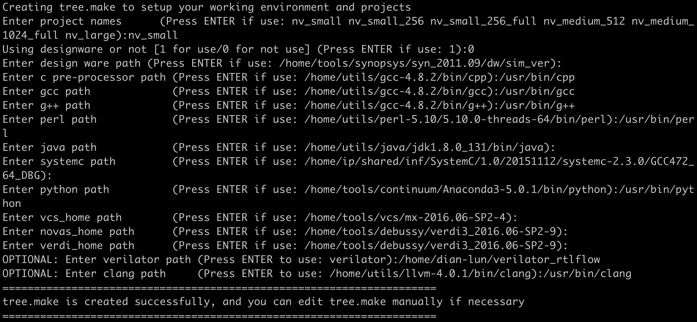

# RTLflow-benchmarks
Benchmarks for RTLflow

# Build RTLflow
You will need to build [RTLflow](https://github.com/dian-lun-lin/verilator) first.

# Simulate NVDLA design


## Step 1: Build NVDLA (hw_small)
```bash
~$ cd hw_small
~/hw_small$ make
```
You will need to setup your environment to build NVDLA design. To simulate NVDLA design using RTLflow, you need to setup your cpp, gcc, g++, perl, java, python, verilator (RTLflow) and clang path correctly. For example:
<p align=center>

</p>

For perl, you need to install YAML and XML::Simple module:
```bash
sudo apt install libconfig-yaml-perl
sudo apt-get install libxml-simple-perl
```

After setting your environment, you need to use tmake to build the RTL

```bash
~/hw_small$ ./tools/bin/tmake -build vmod
```

## Step 2: Build RTLflow simulator for NVDLA
We build RTLflow atop Verilator. Before you build RTLflow simulator, make sure you set ```$VERILATOR_ROOT = ~/YOUR_RTLFLOW_DIR```.
We currently simulate one testbench per gpu thread. You should set $GPU_THREADS to the total number of testbenches.
 ```bash
 ~/hw_small$ cd verif/rtlflow/
 ~/hw_small/verif/rtlflow$ make GPU_THREADS=NUM_TESTBENCHES_YOU_WANT_TO_SIMULATE
 ```
 After compiling, you will see transpiled .cu files and the compiled bin file (VNV_nvdla) under ```~/hw_small/outdir/rtlflow_$GPU_THREADS```

## Step 3: Generate testbenches
You can generate numbers of testbenches by using our scripts. Our scripts generate multiple testbenches by randomly concatanting testbenches offered by NVDLA.

```bash
~/hw_small$ cd verif/verilator/tb_gen_scripts/
~/hw_small/verif/verilator/tb_gen_scripts/$ bash read_traces.sh
~/hw_small/verif/verilator/tb_gen_scripts/$ bash tbs_random_generator.sh NUMBER_OF_TESTBENCHES_YOU_WANT
```
Your testbenches will be under ```hw_small/verif/verilator/tb_gen_scripts/random_traces```.


