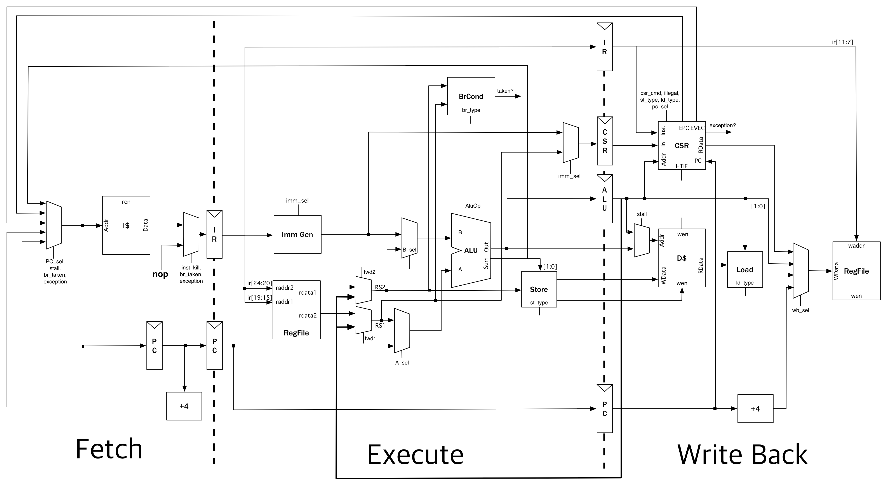

# riscv-mini
  forked from https://github.com/ucb-bar/riscv-mini.git

## Datapath Diagram

## Getting Started

    $ cd riscv-mini
    $ make            # generate firrtl & verilog files in generated-src
    
The verilog output file can be used for verilator simulation or the ASIC tool flow.
    
## Running RTLflow Simulation

First, generate the verilator binary:

    $ make -f Makefile_rtlflow
    
This will generate `VTile` in the top-level directory.

